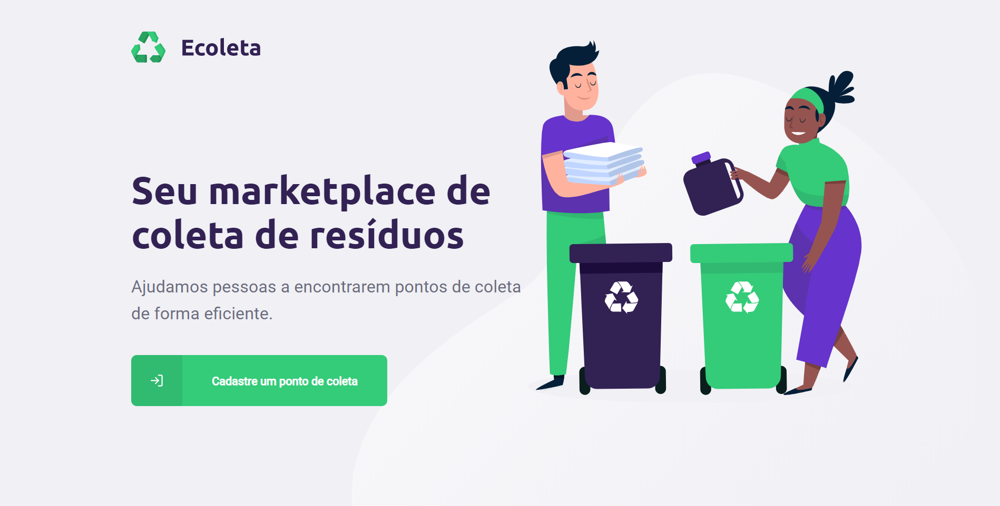
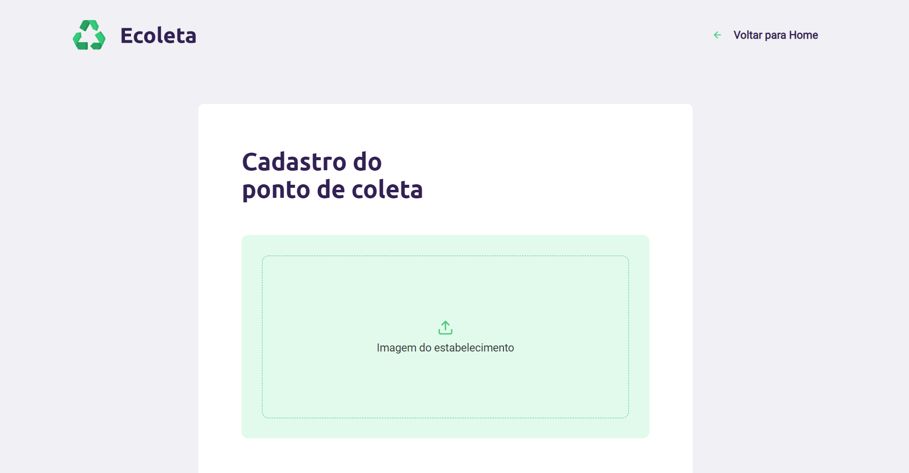
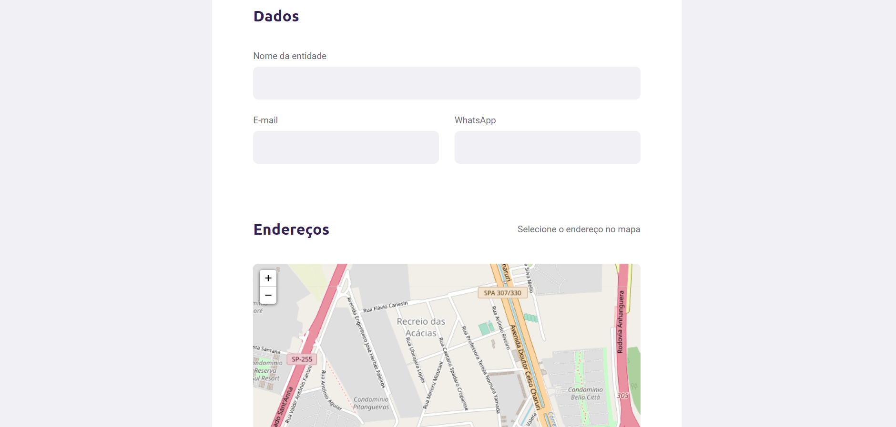
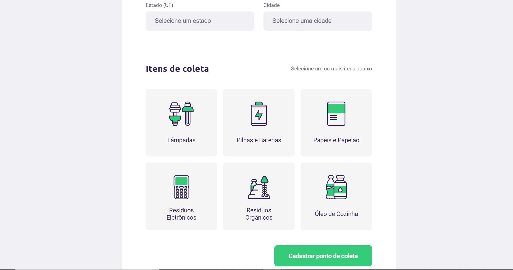
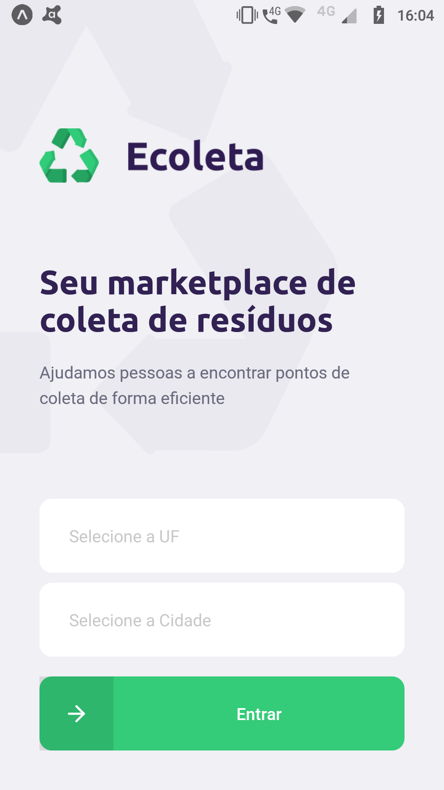
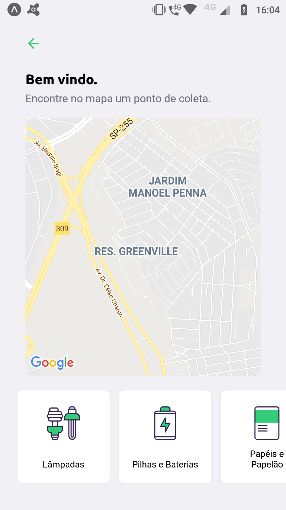
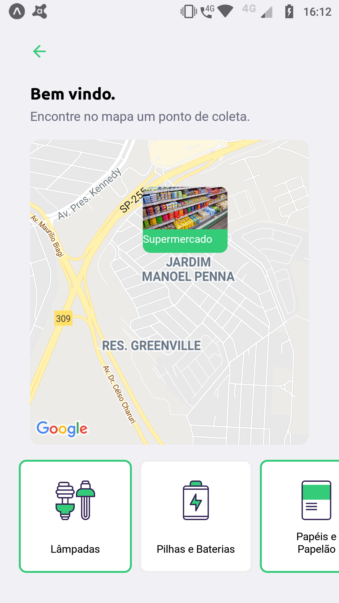
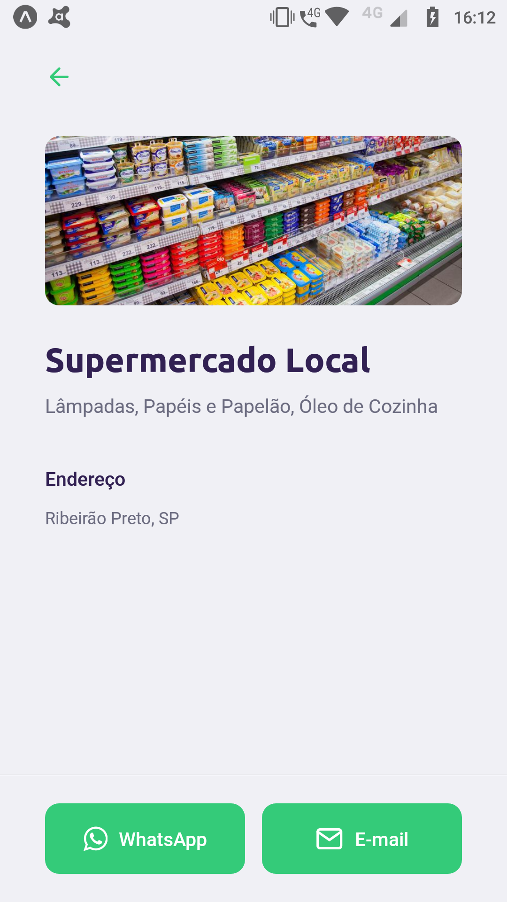

# Introdução

Ecoleta - Aplicação para cadastro de pontos de coleta de resíduos.

# Sobre o build

O app foi criado com a utilização das seguintes ferramentas:

Para o backend:
- Node;
- Typescript;
- Knex;
- SQLite;
- Express;
- CORS;

Para o frontend:
- React;
- React-Router-Dom;
- Typescript;
- Axios;
- Leaflet

# Execução

Backend:

 - npm run dev

Frontend:

- npm start

Mobile:

- expo start

# Screenshots

